# Brevity
### <b>A blog site made for experience and resource sharing.</b>
<br/>

## Motivation
This is a blog site where experienced people can share their knowledge and the difficulties they faced while learning a particular topic. Beginners can ask for resources and seek help from experts. It will connect beginners with experts.   
Currently most of us use Facebook for this purpose which is overwhelming and distracting. Brevity means precise and exact use of words. It will always encourage to the point discussion.  

## Features Implemented
* A Responsive UI for users
* User Authentication
  * Login, Register 
  * Password Reset
* User Profile
  * Update Profile 
* Post 
  * CRUD operation
  * Upvote, Downvote 
  * Comment 
    * Anyone can Comment 
    * can be deleted by Post Author and Comment Author
  * Resource 
    * Post Author can Upload files with valid extensions (within specified size) 
    * Anyone can Download Resource files from post
  * Users can Bookmark their favourite posts
  * Tag
    * Users can assign specific Tags to their post
    * Update Tag
   
* Search Post with 
  * Title
  * Tag (using 3rd bracket)
  * Admin defined Tag (e.g. If user searches with [dbms] tag then search results will contain posts of [dbms] tag along with [database] tag)  
 
* Sort Post
  * by Date
  * by Popularity 
  * on search results
* User Contribution
  * based on Upvote, downvote
  * Top Contributors list
* Create/Edit post content using Rich text editor
  * Create Table
  * Insert image by url
  * various font styles 
  * Numbered/Bulleted list


* More Features:
  * Infinite scroll and lazy loading 
  * One can see all post of a particular user by clicking on his/her username
  * User summary in a popup panel when hovering over the user's name

## Used Technologies
*  Framework: Flask
*  Language: Python
*  Database: MySQL
*  Frontend: HTML, CSS, JavaScript, HTMX

## Clone this Project
```
git clone https://github.com/riyadomf/Brevity.git
```
## Run the Project in your Machine

Install virtual environment:
```
pip install virtualenv
```
Create your own environment:
```
virtualenv <yourenvname>
```
Activate your environemnt:
```
source <yourenvname>/Scripts/activate
```
Now install requirements.txt:
```
pip install -r requirements.txt
```
Edit the file named ".env.example" and assign SECRET_KEY, SQLALCHEMY_DATABASE_URI, MAIL_USERNAME, MAIL_PASSWORD according to instructions written in the file and rename the file name as ".env".  
<br>
Create database from python CLI before running the server:
```
from brevity import create_app
from brevity import db
app = create_app()
app.app_context().push()
db.create_all()
```
Then run the server:
```
python run.py
```
## Some Snapshots

<p  align="center">
  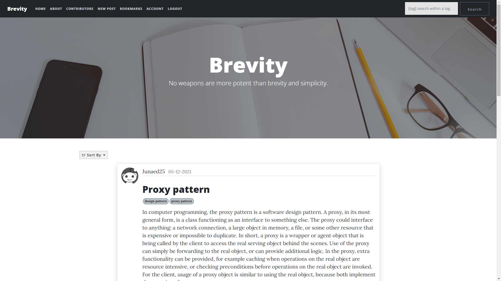
</p>
<p align="center">Home Page</p>

<p  align="center">
  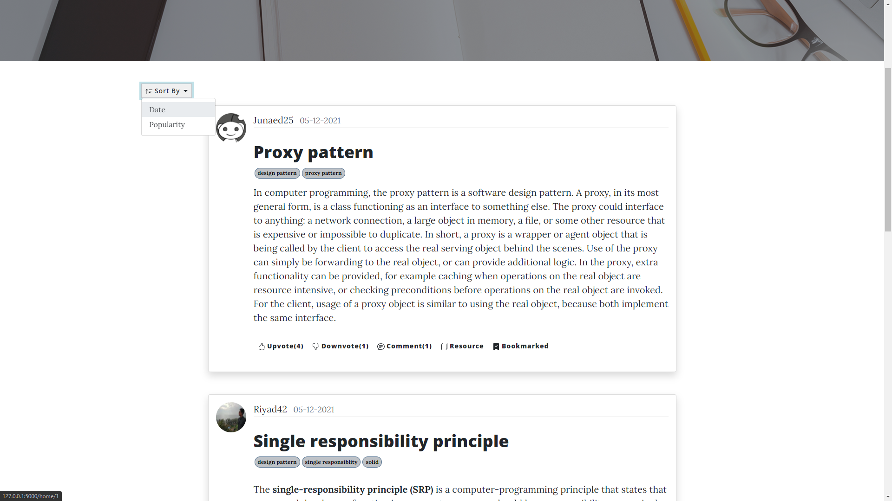 
</p>
<p align="center">Sort</p>
<p  align="center">
  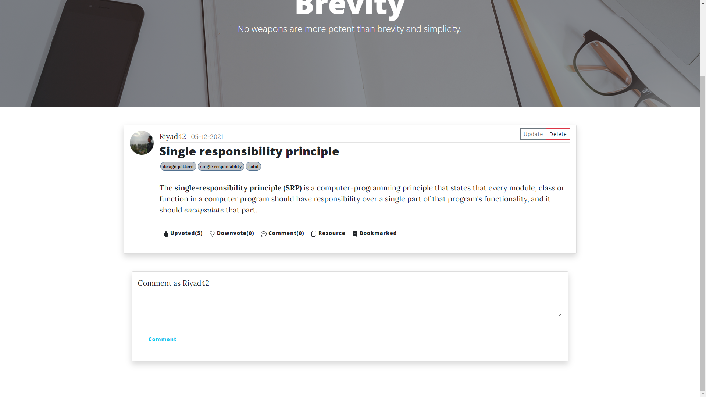
</p>
<p align="center">Post Update, Delete</p>
<p  align="center">
  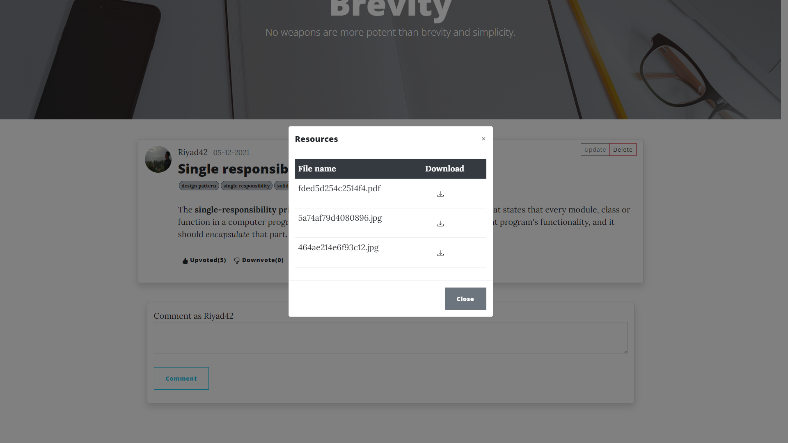
</p>
<p align="center">Resource Files</p>
<p  align="center">
  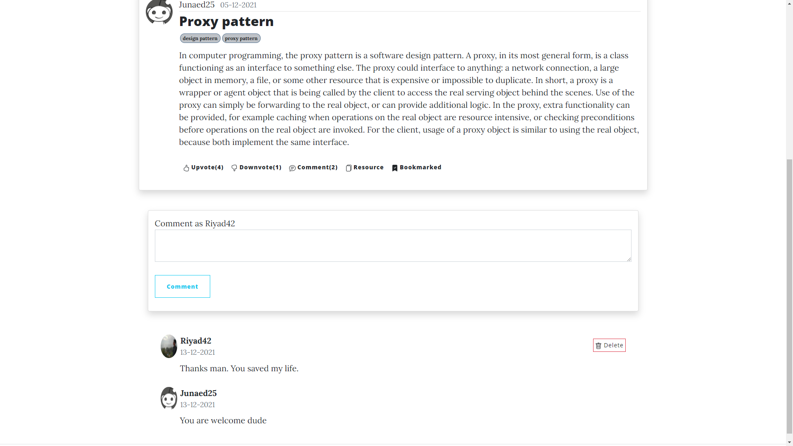
</p>
<p align="center">Comment</p>
<p  align="center">
  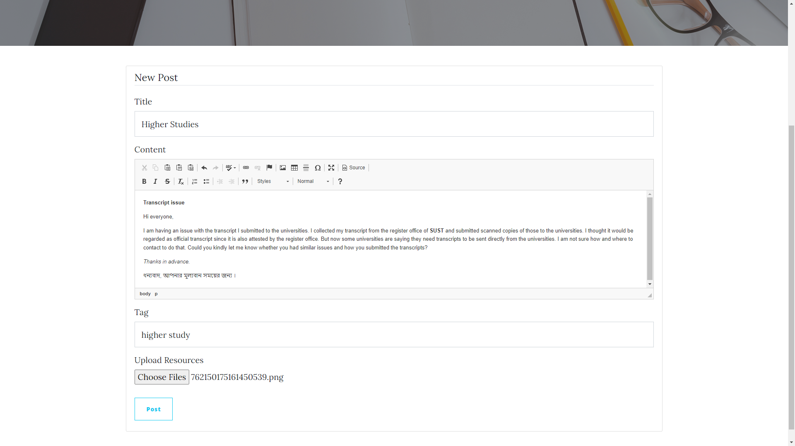
</p>
<p align="center">Rich Text Editor</p>
<p  align="center">
  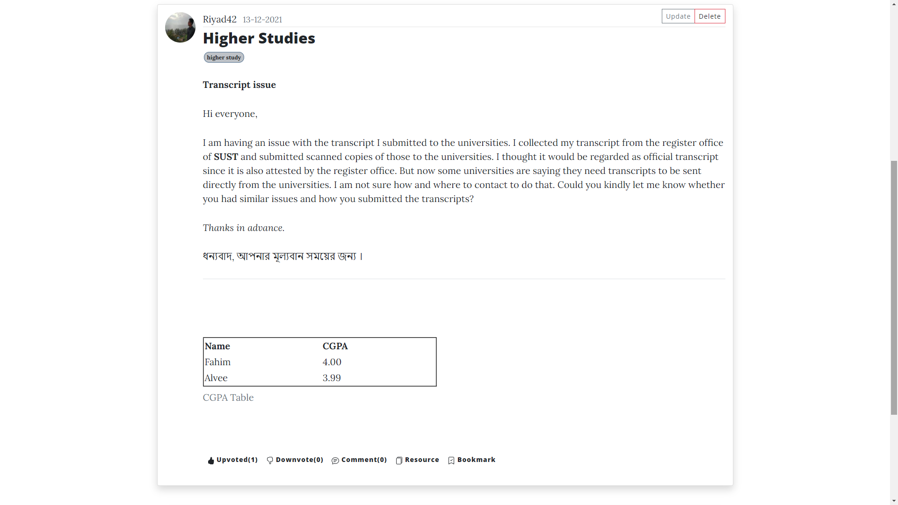
</p>
<p align="center">Rich Text Editor output</p>
<p  align="center">
  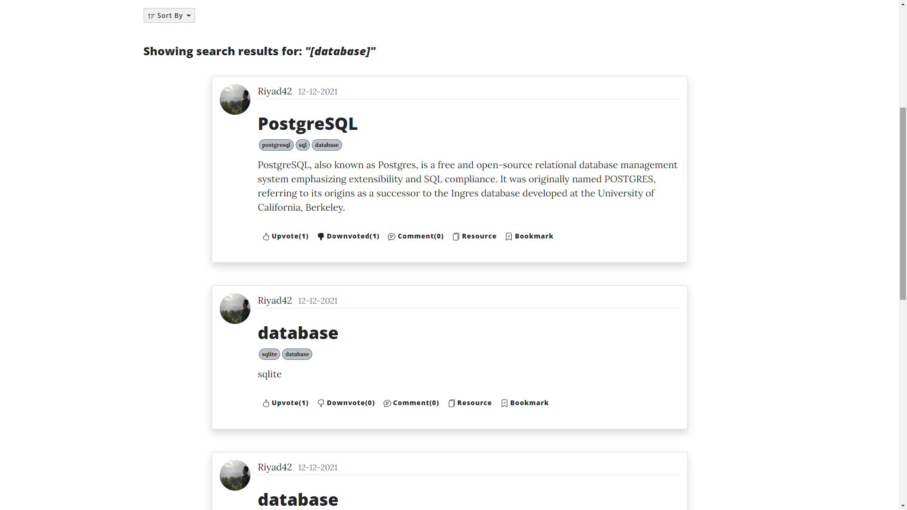
</p>
<p align="center">Search Result</p>
<p  align="center">
  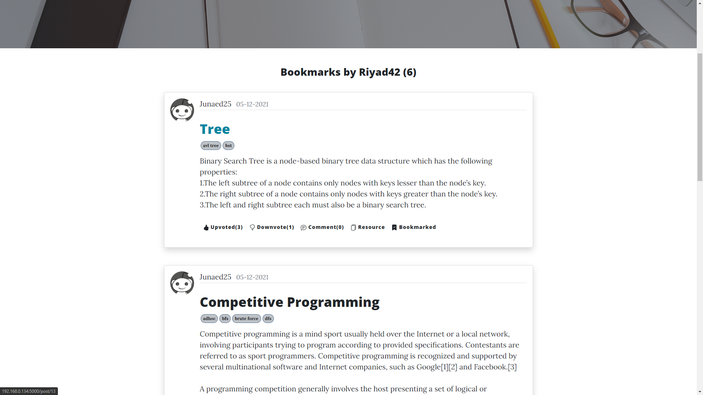
</p>
<p align="center">Bookmark</p>
<p  align="center">
  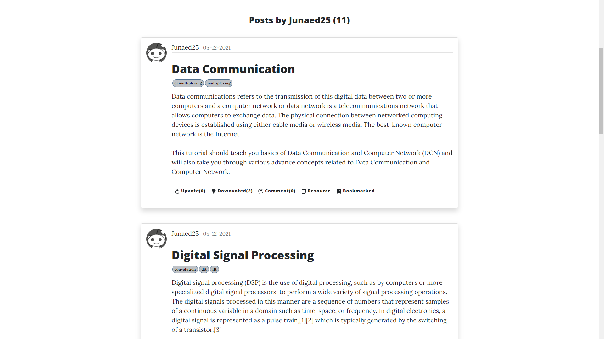
</p>
<p align="center">Individual Post</p>
<p  align="center">
  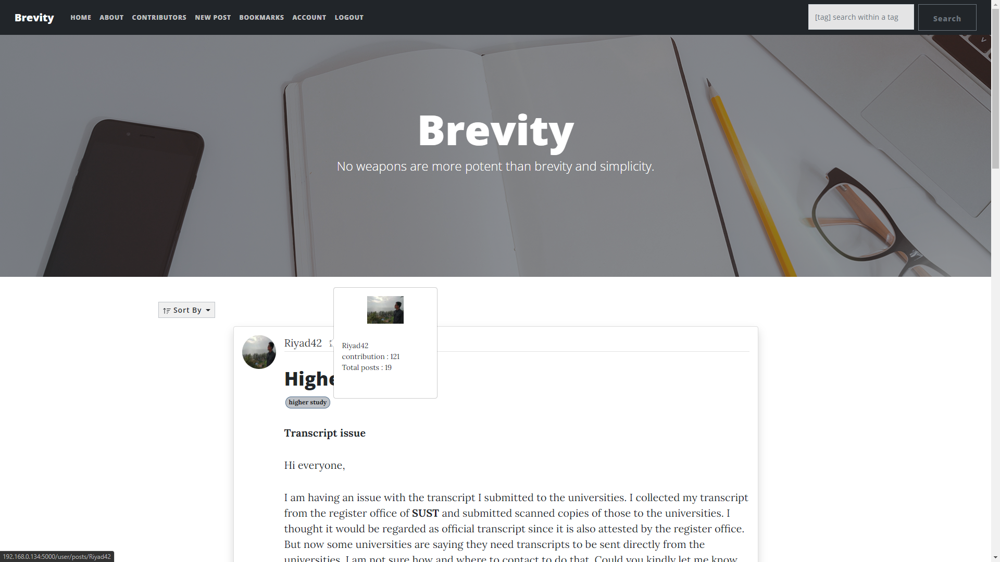
</p>
<p align="center">User Summary Popover</p>
<p  align="center">
  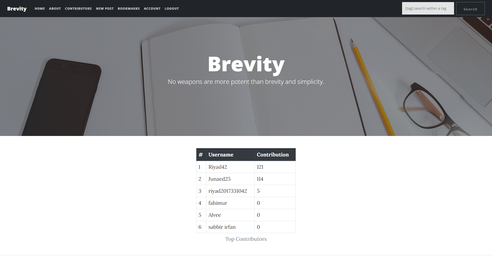
</p>
<p align="center">Contributor List</p>

## Contributors
- <b>[Jahedul Alam Junaed (2017331025)](https://github.com/Nowshadjunaed)</b>
- <b>[Omar Faruqe Riyad (2017331042)](https://github.com/riyadomf)</b>

